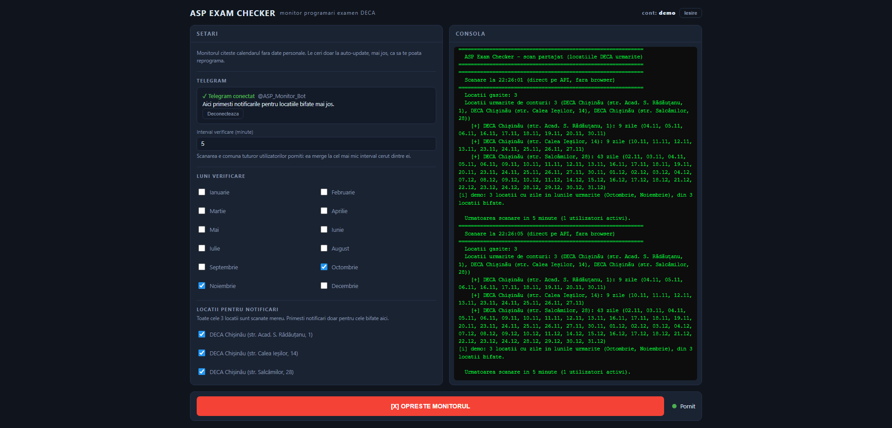

# ASP Exam Checker

Monitor pentru locurile libere la examenul practic (categoria B) la cele 3 filiale
DECA Chisinau. Cand apare o zi libera in lunile alese, primesti mesaj pe Telegram.
Optional, te poate reprograma singur pe o zi mai devreme sau iti poate face prima
programare.

## Incearca-l / Give it a try

**https://asp-monitor.onrender.com**

Contul nou cere un cod de invitatie. Scrie-mi si ti-l dau.

An account needs an invite code, so contact me for the pass code.



## Cum functioneaza

1. Iti faci cont si apesi **Conecteaza Telegram**. Se deschide botul, apesi START si gata.
2. Bifezi lunile si locatiile care te intereseaza:
   - str. Acad. S. Radautanu, 1
   - str. Calea Iesilor, 14
   - str. Salcamilor, 28
3. Apesi **PORNESTE MONITORUL**.
4. Serverul citeste calendarul ASP la intervalul ales. Pentru asta nu are nevoie
   de date personale si nici de browser.
5. Cand apare o zi libera intr-o luna si o locatie bifate de tine, primesti
   mesaj pe Telegram.

Scanarea e una singura pentru toti utilizatorii. Cine porneste al doilea doar
incepe sa primeasca notificari din aceeasi scanare. Scanarea se opreste cand nu
mai are niciun utilizator pornit.

Comenzi in bot: `/status` (starea monitorului tau), `/stop` (deconecteaza chatul).

## Auto-update programare

Daca ai deja o programare, monitorul o poate muta singur pe un loc mai bun.
Completezi IDNP, seria si data buletinului, codul programarii (APO...), numarul
cererii, data programarii curente si locatia tinta. Ai doua moduri:

- **Doar mai devreme**: te muta numai pe o zi mai devreme decat programarea curenta.
- **In lunile alese**: te muta intai in lunile bifate (chiar daca e mai tarziu),
  apoi doar mai devreme.

Reprogramarea merge direct prin API-ul ASP, fara browser. Dupa mutare, data noua
se salveaza singura si primesti confirmarea pe Telegram.

ASP limiteaza de cate ori poti modifica o programare. Cand dreptul de modificare
s-a consumat, auto-update nu te mai poate muta.

## Prima programare

Daca ai depus cererea si ai platit, dar inca nu ai o programare, lipesti linkul
primit de la ASP (`.../cerere/APO01/...`) si apesi **VERIFICA LINKUL**. La primul
loc liber din lunile alese te programeaza automat si iti trimite codul pe Telegram.
Nu o folosi daca ai deja o programare, pentru asta e auto-update.

## Date personale

- Monitorul nu trimite date personale catre ASP.
- IDNP-ul si buletinul se folosesc doar la reprogramare.
- Nu se face nicio plata automat.

## Rulare locala

```bash
pip install -r requirements.txt
python -m playwright install chromium
set ASP_TG_TOKEN=<tokenul botului de la @BotFather>
python web.py
```

Apoi deschizi http://127.0.0.1:8766.

## Variabile de mediu

| Variabila | Rol |
|---|---|
| `ASP_TG_TOKEN` | botul Telegram comun (obligatoriu, fara el monitorul nu porneste) |
| `ASP_REGISTER_CODE` | codul de invitatie pentru conturi noi (gol = oricine isi poate face cont) |
| `ACCOUNTS_JSON` | conturile si setarile, ca sa supravietuiasca restarturilor pe Render |
| `RENDER_API_KEY` | permite aplicatiei sa-si salveze singura `ACCOUNTS_JSON` |
| `ASP_API_PROXY`, `ASP_API_PROXY_SECRET` | releul Cloudflare din `proxy/` pentru rutele eservicii |
| `ASP_AUTOSTART` | `1` = monitorul porneste singur dupa restart |
| `ASP_UI_PASSWORD` | parola contului `admin` creat la prima pornire din `credentials.json` |

Detaliile de deploy (Render, releul Cloudflare, limita de ore gratuite) sunt in
[DEPLOY.md](DEPLOY.md).

## Structura

| Fisier | Ce face |
|---|---|
| `web.py` | serverul web: conturi, scanare comuna, bot Telegram, persistenta |
| `index.html` | interfata web |
| `dist/scrapper.py` | citirea calendarului, reprogramarea, prima programare |
| `proxy/worker.js` | releul Cloudflare pentru rutele eservicii |
| `app.py` | varianta desktop veche (customtkinter), build cu `build.bat` |
| `Dockerfile`, `render.yaml` | deploy pe Render |
